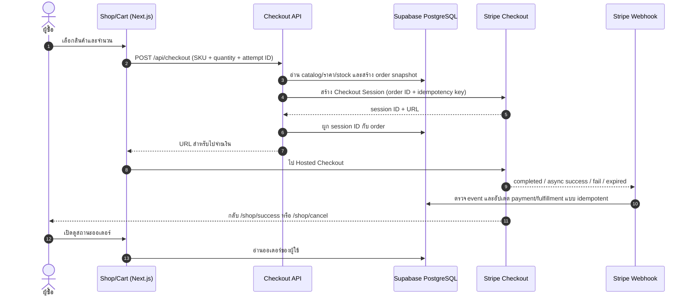

# Pawsons Shop — Phase 4 Implementation Plan

> **อัปเดตการตัดสินใจ 28 ก.ย. 2026:** ชุดเปิดขายแรกเป็นสติกเกอร์/โปสการ์ดของ Pawsons เท่านั้น, ซื้อแบบไม่ต้องล็อกอิน, ใช้ Stripe-hosted Checkout ในแซนด์บ็อกซ์ Pluem และยังไม่ใช้ Connect; Digital Item เป็นงานภายหลัง รายชื่อประเทศจัดส่งและข้อมูลสินค้าจริงยังไม่พร้อม ดูสถานะล่าสุดใน [STRIPE-IMPLEMENTATION.md](STRIPE-IMPLEMENTATION.md). ข้อเสนอเดิมด้านล่างที่ระบุให้ล็อกอินก่อนซื้อหรือรวม Digital Item ใน MVP ให้ถือว่าแทนที่ด้วยข้อนี้

> แผนระบบร้านค้าฉบับลงลึก · อ้างอิง `ROADMAP.md` · ปรับปรุง 28 กันยายน 2026
>
> สถานะ: ทดสอบ Stripe Checkout และ webhook probe ใน sandbox แล้ว ยังไม่เปิดรับคำสั่งซื้อจริง และยังไม่ได้ทำ migration ออเดอร์

---
## ภาพรวมและขอบเขต

**เป้าหมาย:** เปลี่ยน `/shop` จากหน้าตัวอย่างเป็นร้านที่ซื้อได้จริง ทั้งสินค้า Physical Merch และ Digital Items โดยให้ราคา ออเดอร์ การชำระเงิน และการส่งมอบตรวจสอบย้อนหลังได้ ลูกค้าต่างประเทศชำระเงินผ่าน Stripe Hosted Checkout ได้ตามความสามารถของบัญชีร้านจริง

**สถานะปัจจุบัน:** `/shop` ยังใช้ตัวละครจาก `src/lib/data.ts` ทำภาพตัวอย่าง Sticker/Postcard และแสดง “COMING SOON”; ยังไม่มี catalog สินค้าจริง, cart, order API หรือ webhook สำหรับจัดการออเดอร์จริง ส่วน SQL `orders` ใน `ROADMAP.md` เป็นเพียงภาพร่าง ไม่ใช่ migration ที่พร้อมใช้ ให้ปรับก่อนเริ่ม Phase นี้

## 4.0 ข้อสรุปที่ต้องได้ก่อนเริ่มรับเงินจริง

| เรื่อง | ค่าเริ่มต้นที่เสนอสำหรับ MVP | สิ่งที่ต้องยืนยัน |
| --- | --- | --- |
| ประเทศของบัญชีร้าน | วางแผนบนสมมติฐานว่าบัญชี Stripe จดทะเบียนในไทย | ประเทศนิติบุคคล/บุคคล, เอกสารยืนยันตัวตน, บัญชีธนาคารรับเงิน |
| สินค้าเปิดขาย | เริ่มด้วย Sticker/Postcard จำนวน SKU จำกัด และ Digital Item แบบสิทธิ์ถาวร 1–2 รายการ | SKU จริง, ราคา, ต้นทุน, รูป, จำนวนสต็อก, สิทธิ์การใช้ไฟล์/ภาพ |
| ผู้ซื้อ | MVP ให้ล็อกอินก่อนซื้อ เพื่อผูก Digital Item และประวัติออเดอร์กับบัญชี | ถ้าต้องการ guest checkout สำหรับสินค้าจริง ให้แยกเป็นงานต่อยอดพร้อมระบบยืนยันอีเมล/ดูออเดอร์ |
| ประเทศจัดส่ง | เปิดเฉพาะประเทศที่มีอัตราส่งและขั้นตอนส่งของจริง | รายชื่อประเทศ, ค่าส่ง, ระยะเวลา, tracking, ใครจ่ายอากรนำเข้า |
| ภาษี/เอกสาร | ให้ผู้รับผิดชอบบัญชี/ภาษีตัดสินใจเรื่อง VAT, sales tax, ใบกำกับ และนโยบายคืนเงิน | เปิด Stripe Tax เฉพาะหลังตั้งค่าธุรกิจและการจดทะเบียนที่เกี่ยวข้องครบ |
| สกุลเงิน | กำหนดราคาหลักเป็น THB และบันทึกจำนวนเงินในหน่วยย่อยของสกุลเงิน | ต้องการราคาคงที่ USD เพิ่มหรือไม่; ตรวจ Adaptive Pricing ในบัญชีจริงก่อนเปิด |

Stripe รองรับบัญชีร้านในไทย แต่ความสามารถของวิธีจ่ายขึ้นกับประเทศบัญชีและลูกค้า: บัญชีไทยรับเงินชำระได้หลายสกุลแต่ยอดเบิกจ่ายเป็น THB, PromptPay ใช้ THB, และ Apple Pay ของผู้ค้าไทยใช้ได้กับลูกค้าต่างประเทศที่เข้าเงื่อนไขเท่านั้น ตาม [Stripe Thailand availability](https://stripe.com/global) และ [Stripe Thailand payment methods](https://support.stripe.com/questions/supported-payment-methods-currencies-and-businesses-for-stripe-accounts-in-thailand?locale=en-GB) ดังนั้น **ไม่เขียนว่า Checkout จะสลับ USD/THB หรือแสดง Apple Pay ให้ทุกคนโดยอัตโนมัติ**; ให้ทดสอบความสามารถจริงใน test mode ของบัญชีร้านก่อน

## 4.1 ขอบเขต MVP และลำดับงาน

| ช่วง | งานส่งมอบ | เกณฑ์จบงาน |
| --- | --- | --- |
| 4.1A Catalog | สินค้าจริงในฐานข้อมูล, รูป, ราคา, SKU, สถานะขาย, ตัวกรอง Character/House/ชนิดสินค้า และหน้า admin จัดการ | ปิดขายแล้วกดซื้อไม่ได้; ราคา/รูป/สต็อกหน้า Shop ตรงฐานข้อมูล |
| 4.1B Cart | ตะกร้า drawer บนมือถือและเดสก์ท็อป, เพิ่ม/ลด/ลบ, เก็บชั่วคราวใน browser, สรุปราคาก่อนจ่าย | รีเฟรชแล้วยังเห็น cart; จำนวนและยอดรวมถูกต้อง; cart ไม่มีราคาที่เชื่อถือจาก client |
| 4.1C Checkout | `POST /api/checkout` ตรวจสินค้าและสร้าง pending order + Stripe Checkout Session | กดซ้ำไม่สร้างออเดอร์หรือ Session เกินจำเป็น; ผู้ใช้ถูกส่งไป `session.url` |
| 4.1D Payment events | `POST /api/webhooks/stripe` ยืนยันลายเซ็นและปรับสถานะออเดอร์แบบ idempotent | webhook ซ้ำ/มาผิดลำดับไม่ส่งของหรือมอบ Digital Item ซ้ำ |
| 4.1E Fulfillment | Digital Item เข้า `user_inventory`; สินค้าจริงเข้าสู่คิวแพ็ก/ส่งพร้อม tracking | ไม่มีการส่งมอบก่อนยืนยันว่าชำระแล้ว; มีร่องรอยให้ฝ่ายร้านติดตาม |
| 4.1F Launch | หน้า success/cancel, ประวัติออเดอร์, admin order view, คู่มือคืนเงินและกระทบยอด | ผ่าน test mode, webhook replay, คำสั่งซื้อจริงมูลค่าต่ำ และ checklist ด้านล่าง |

**ยังไม่รวมใน MVP:** subscription, marketplace/หลายผู้ขาย, guest checkout, coupon ขั้นสูง, ระบบคิดค่าส่งแบบ real-time หลายขนส่ง, การแปลงสกุลเงินเอง, และการออกใบกำกับภาษีอัตโนมัติที่ยังไม่ได้ข้อกำหนดธุรกิจ งานเหล่านี้เพิ่มหลังมีข้อมูลการใช้งานจริง

## 4.2 ข้อมูลและสิทธิ์เข้าถึง

- `products`: ชื่อ/คำอธิบายไทย–อังกฤษ, ประเภท `physical|digital`, Character, House, ภาพ, สถานะ draft/active/archived, tax category และข้อมูลการส่งมอบ Digital Item
- `product_variants`: SKU, ตัวเลือกขนาด/ชุด, น้ำหนักหรือข้อกำหนดส่งของ, จำนวนคงเหลือหรือสถานะไม่จำกัดสต็อก; SKU ต้องไม่ซ้ำ
- `product_prices`: variant, currency, จำนวนเต็มในหน่วยย่อย, Stripe Price ID ถ้าใช้ราคาใน Stripe; ห้ามเก็บเงินเป็น float และอย่าให้ browser ส่งราคามาตัดสินยอด
- `orders`: owner, email snapshot, สถานะคำสั่งซื้อ/ชำระเงิน/ส่งมอบแยกกัน, ยอดสินค้า/ค่าส่ง/ภาษี/รวม, currency, Stripe Session ID **nullable จนกว่าจะสร้าง Session สำเร็จ**, PaymentIntent ID, ที่อยู่ส่งเฉพาะรายการที่ต้องใช้, เวลาและเหตุการณ์สำคัญ
- `order_items`: variant/SKU, ชื่อสินค้าและราคาขณะซื้อ, จำนวน, ประเภท Physical/Digital, สถานะส่งมอบต่อชิ้น; snapshot นี้ต้องไม่เปลี่ยนเมื่อ admin แก้ catalog ภายหลัง
- `stripe_webhook_events`: Stripe event ID แบบ unique, type, เวลารับ, สถานะประมวลผล/ข้อผิดพลาด เพื่อกัน event ซ้ำและ replay อย่างตรวจสอบได้
- `stock_reservations` **เฉพาะ SKU ที่มีสต็อกจำกัด**: จองจำนวนเมื่อเริ่ม Checkout แบบ atomic, ตั้งหมดอายุ, ปล่อยเมื่อ session หมดอายุ/ชำระไม่สำเร็จ; ถ้าสินค้าทั้งหมดผลิตตามสั่งให้ตัดส่วนนี้ออกได้
- `user_inventory`: เพิ่มที่มา `order_item_id` หรือ entitlement ledger เพื่อให้มอบสิทธิ์หนึ่งครั้งต่อสินค้าที่ซื้อ; ไอเทมใช้แล้วหมดไปต้องออกแบบยอดคงเหลือ/ledger แยกจากสิทธิ์ถาวร

ทำ migration ที่ทบทวนได้ แทนการคัดลอก SQL ภาพร่างด้านบนตรง ๆ: กำหนด foreign key, unique constraint, check constraint, index สำหรับ SKU/owner/status/session/event ID, สถานะที่อนุญาต และนโยบาย retention ของที่อยู่จัดส่ง ตารางใน `public` ต้องเปิด RLS พร้อมจำกัด `GRANT`: คนทั่วไปอ่านได้เฉพาะ catalog ที่ active, ลูกค้าอ่านได้เฉพาะออเดอร์ของตัวเอง, client ห้ามแก้ยอดเงิน/สถานะชำระ/สต็อก, งาน webhook และ admin ใช้สิทธิ์ฝั่ง server เท่านั้น แล้วทดสอบทั้งกรณีอนุญาตและปฏิเสธตาม [Supabase RLS guide](https://supabase.com/docs/guides/database/postgres/row-level-security)

## 4.3 ประสบการณ์ซื้อสินค้า

1. หน้า `/shop` อ่านสินค้า active จากฐานข้อมูล มี filter Character, House และ Physical/Digital; หน้า `/shop/[slug]` แสดงรูปหลายมุม ราคา สิ่งที่จะได้รับ สต็อก/ระยะเวลาจัดส่ง และนโยบายคืนสินค้า
2. Cart drawer เปิดเร็วบนมือถือ; ปุ่มเพิ่มสินค้ามี feedback ทันที, แสดงจำนวน, ยอดสินค้า, ข้อความว่าค่าส่ง/ภาษีจะยืนยันก่อนจ่าย, สถานะหมดสต็อก และปุ่ม Checkout ที่กดซ้ำไม่ได้ระหว่างสร้าง Session
3. หากมี Digital Item ให้ตรวจว่าล็อกอินก่อน Checkout; เมื่อกลับจาก Google Login ให้ cart เดิมยังอยู่
4. หากมีสินค้าจริง ให้ Stripe Checkout เก็บที่อยู่เฉพาะประเทศที่จัดส่งได้ และเลือกอัตราส่งตามกติกาที่ร้านกำหนด; cart ดิจิทัลล้วนไม่ต้องถามที่อยู่จัดส่ง
5. หน้า `/shop/success?session_id={CHECKOUT_SESSION_ID}` ดึงข้อมูลออเดอร์จาก server หลังตรวจสิทธิ์ผู้ใช้ แสดง `กำลังยืนยันการชำระเงิน` ได้ถ้า webhook ยังไม่มา; หน้า `/shop/cancel` พากลับ cart โดยไม่แสดงว่าจ่ายแล้ว
6. `/shop/orders` แสดงประวัติ, รายการ, สถานะส่งสินค้า, tracking และช่องทางติดต่อเรื่องคำสั่งซื้อ; หน้าสำเร็จเปิดซ้ำได้โดยไม่มอบไอเทมซ้ำ

## 4.4 การสร้าง Checkout Session (`POST /api/checkout`)

1. ตรวจ session ผู้ใช้บน server; รับจาก browser แค่ `{sku, quantity}` และรหัส cart attempt ไม่รับ `unit_amount`, `currency`, `user_id` หรือสถานะชำระเงินจาก client
2. อ่านสินค้า active/price/stock จากฐานข้อมูล ตรวจจำนวนและประเทศจัดส่งที่เลือกได้; คำนวณยอดใหม่ทั้งหมดบน server และสร้าง `orders` + `order_items` snapshot ในสถานะ `checkout_pending`
3. สำหรับสต็อกจำกัด จองสต็อกผ่านธุรกรรมฐานข้อมูลที่กันการชนกันของผู้ซื้อสองคน; กำหนดเวลาหมดอายุและวิธีคืนสต็อก
4. เรียก Stripe Checkout Sessions API แบบ `mode=payment`, ส่งรายการราคา/จำนวน, `client_reference_id` หรือ metadata เป็น order ID, success/cancel URL จากค่าคอนฟิกฝั่ง server, และ Stripe idempotency key ที่ผูกกับ cart attempt
5. บันทึก `stripe_session_id` และคืนเฉพาะ `session.url` ให้ browser; ถ้าสร้าง Session ไม่สำเร็จ ให้ order ไปสถานะที่ตรวจสอบได้และคืน stock reservation
6. จำกัดจำนวนครั้ง/ขนาด cart และ validate redirect origin; เก็บ `STRIPE_SECRET_KEY` เฉพาะ server. Hosted Checkout ใช้ `session.url` ได้โดยตรง จึง **ยังไม่จำเป็นต้องติดตั้ง `@stripe/stripe-js`** สำหรับ MVP (ติดตั้ง `stripe` ฝั่ง server เท่านั้น) ตาม [Checkout quickstart](https://docs.stripe.com/payments/checkout/quickstarts) และ [Session API](https://docs.stripe.com/api/checkout/sessions/create)

**สกุลเงิน:** เริ่มด้วยราคา THB ที่กำหนดแน่นอน; จำนวนเงินส่ง API เป็นหน่วยย่อยของสกุลเงินตาม [Stripe currencies](https://docs.stripe.com/currencies) ถ้าต้องการราคาคงที่ USD ให้สร้างราคาคนละ currency และกติกาเลือกที่ชัดเจน หากต้องการ Adaptive Pricing ให้ตรวจว่าเปิดได้กับบัญชี/สินค้า/Checkout นี้ก่อน และทดสอบยอดที่ลูกค้าเห็นจริงรวมค่าธรรมเนียมแปลงสกุลตาม [Stripe Adaptive Pricing](https://support.stripe.com/questions/adaptive-pricing?locale=en-GB) ห้ามคำนวณอัตราแลกเปลี่ยนใน browser แล้วอ้างว่าเป็นยอดที่ Stripe จะเรียกเก็บ

## 4.5 Webhook และ state machine ของออเดอร์

- Route `POST /api/webhooks/stripe` อ่าน **raw request body** และ `Stripe-Signature` เพื่อ verify ด้วย webhook signing secret; signature ผิดตอบ 400, การบันทึก event/ออเดอร์ล้มเหลวตอบ 5xx เพื่อให้ Stripe retry. Secrets ของ test/live ต้องแยกกัน
- รับ `checkout.session.completed`: เช็ก `payment_status` ของ Session; ถ้า `paid` จึงเข้าสู่ `paid`, ถ้า `unpaid` ให้ค้าง `payment_processing` และรอ event ต่อไป
- รับ `checkout.session.async_payment_succeeded` และ `checkout.session.async_payment_failed` สำหรับวิธีจ่ายที่ยืนยันช้า; รับ `checkout.session.expired` เพื่อปิด pending order และคืน reservation
- วางขั้นตอนสำหรับ refund/partial refund และ dispute: เชื่อม event ที่เปิดใช้งานจริงกับสถานะออเดอร์, คลังสินค้า, สิทธิ์ดิจิทัล และงานฝ่ายบริการ; Digital Item ที่ใช้แล้วต้องมีนโยบายคืนเงินชัดเจน
- Process event แบบ idempotent: unique event ID และ unique Stripe Session ID, state transition ที่ไม่ย้อนจาก `paid` กลับ `pending`, และ unique source order item ในการมอบไอเทม; event ซ้ำหรือมาผิดลำดับต้องไม่ทำให้ส่งของซ้ำ
- หน้า success เป็นหน้าดูผลเท่านั้น **ไม่ใช่หลักฐานว่าจ่ายสำเร็จ**; webhook เป็นแหล่งยืนยันหลักตาม [Stripe fulfillment guide](https://docs.stripe.com/checkout/fulfillment?payment-ui=stripe-hosted) และ [Stripe webhook guide](https://docs.stripe.com/webhooks)

## 4.6 ส่งมอบสินค้าและงานหลังบ้าน

- **Digital:** เมื่อยืนยัน `paid` ให้เพิ่ม entitlement เข้า `user_inventory` ในธุรกรรมเดียวกับการ mark fulfilled; แสดงใน `/room` หรือหน้าคลังตามประเภทไอเทม; ถ้าส่งไฟล์ให้ใช้ URL อายุสั้น/ตรวจสิทธิ์ก่อนดาวน์โหลด
- **Physical:** ออเดอร์ `paid` เข้า queue `unfulfilled` → `packing` → `shipped` → `delivered` พร้อม carrier, tracking, วันส่ง; admin แก้เฉพาะสถานะส่งมอบ ไม่แก้ยอดชำระ Stripe จาก UI
- **Admin:** จัดการสินค้า/รูป/ราคา/สต็อก, ดูออเดอร์และ event ที่ล้มเหลว, replay งานส่งมอบที่ปลอดภัย, ค้นด้วย order ID/Stripe Session ID; การคืนเงินทำผ่าน Stripe Dashboard เป็นค่าเริ่มต้น แล้วให้ webhook sync กลับ
- **สื่อสารลูกค้า:** อีเมลยืนยันคำสั่งซื้อ/จ่ายสำเร็จ/ส่งของต้องส่งเพียงครั้งเดียวต่อ transition และมี contact support, นโยบายคืน/เปลี่ยน, privacy policy, estimated delivery และข้อมูลอากรข้ามแดนก่อนเปิดประเทศจัดส่ง
- **กระทบยอด:** เทียบออเดอร์ paid ใน Supabase กับ Stripe payments/refunds เป็นประจำ พร้อม alert สำหรับ paid แต่ยังไม่ fulfill, webhook ค้าง, สต็อกติดลบ และ shipping ไม่เดิน

## 4.7 แผนทดสอบและเกณฑ์เปิด Live

| กลุ่มทดสอบ | กรณีที่ต้องผ่าน |
| --- | --- |
| Catalog/cart | ราคาเปลี่ยนระหว่างอยู่ใน cart, ปิดขาย, หมดสต็อก, จำนวน 0/ติดลบ/มากเกิน, cart mixed Physical+Digital, reload/mobile |
| Checkout | ผู้ใช้ไม่ล็อกอิน, client แก้ราคา, คลิกซ้ำ/รีเฟรช/เครือข่ายหลุด, session หมดอายุ, ประเทศที่ไม่จัดส่ง, ค่าส่งและภาษี |
| Payment | บัตรสำเร็จ/ปฏิเสธ/3DS, วิธีจ่ายแบบ delayed success/fail ที่บัญชีรองรับ, THB และสกุลเงินที่เปิดจริง, มือถือ/เดสก์ท็อป |
| Webhook | signature ปลอม, event ซ้ำ, event มาผิดลำดับ, server ล่มหลังรับ event, replay, refund บางส่วน/เต็มจำนวน |
| Fulfillment | จ่ายแล้วไม่กลับ success page, success เปิดซ้ำ, Digital grant ครั้งเดียว, stock reservation หมดอายุ, tracking และการคืนเงิน |
| Security | ลูกค้า A อ่านออเดอร์ B ไม่ได้, public อ่านสินค้า draft ไม่ได้, client เขียน payment status ไม่ได้, secret ไม่รั่วลง browser/log |

ใช้ Stripe test mode และ Stripe CLI forward webhook ระหว่างพัฒนา; ทดสอบ RLS ด้วยสิทธิ์ anon/authenticated และรัน typecheck/E2E เส้นทางซื้อจริง ก่อนเปิด Live ให้ตั้งค่า production webhook URL/secret, ตรวจบัญชีและวิธีจ่ายที่เปิด, ผ่านการตัดสินใจด้านภาษี/การจัดส่ง, ทำออเดอร์มูลค่าต่ำจริงหนึ่งรายการ แล้วตรวจครบตั้งแต่ Stripe → webhook → order → fulfillment → refund ทดสอบหนึ่งครั้ง **ปุ่มซื้อเปิดจริงได้เมื่อ checklist นี้ผ่านเท่านั้น**

## 4.8 ภาพระบบที่ต้องสร้าง

**ขอบเขตความรับผิดชอบ:** Browser ถือแค่ cart เพื่อแสดง UI; Supabase เป็นแหล่งข้อมูลสินค้า/ราคา/ออเดอร์/สิทธิ์; Stripe เป็นแหล่งข้อมูลการชำระเงิน; webhook เป็นทางที่ยืนยันการจ่าย; success page เป็นเพียงหน้าดูสถานะ ไม่มีสิทธิ์เขียน `paid` เอง

## 4.9 ออกแบบ Catalog, ราคา และสต็อกให้ใช้งานจริง

### Catalog และรูปสินค้า

- `products` เก็บข้อมูลระดับสินค้าที่ลูกค้าเห็น: `slug` unique, ชื่อ/รายละเอียด `th` และ `en`, `type`, Character/House ที่เกี่ยวข้อง, `status`, `sort_order`, `published_at`, `tax_code`, หมวดหมู่, ข้อความสิ่งที่ได้รับ และเงื่อนไขคืนสินค้า
- `product_variants` เป็นหน่วยที่ซื้อจริง: `sku` unique, `product_id`, ชื่อ variant, น้ำหนัก/ขนาดสำหรับค่าส่ง, `stock_policy` (`finite|unlimited`), `stock_on_hand`, `stock_reserved`, `max_per_order`, `active`; Sticker แบบชุดกับชิ้นเดี่ยวต้องเป็นคนละ SKU
- `product_prices` เก็บ `variant_id`, `currency`, `unit_amount_minor`, `stripe_price_id` หรือข้อมูลที่ใช้สร้าง `price_data`, `active_from/to`; หนึ่ง SKU อาจมีราคา THB และ USD แต่ห้ามเลือก currency ตามข้อมูลที่ client ส่งมาโดยไม่ตรวจ
- รูปสินค้าเก็บใน Supabase Storage (หรือ CDN ที่เลือก) พร้อม `alt` ไทย/อังกฤษ, ลำดับรูป, ขนาดไฟล์/ratio ที่กำหนด; URL สินค้าสาธารณะได้เฉพาะรูป catalog ส่วนไฟล์ดิจิทัลที่ขายต้องอยู่ private storage และตรวจ entitlement ก่อนดาวน์โหลด
- ข้อมูลที่ควรเห็นก่อนกดซื้อ: ราคาและสกุลเงิน, ตัวเลือก variant, จำนวนที่ซื้อได้, สิ่งที่อยู่ในแพ็ก, ประเทศที่ส่ง, ประมาณเวลาจัดส่ง, ค่าส่งที่จะยืนยันใน Checkout, ข้อจำกัดของ Digital Item และนโยบายคืนเงิน

### กติกาสต็อก

- สินค้าผลิตตามสั่งใช้ `unlimited`; จำกัดจำนวนต่อออเดอร์เพื่อกัน abuse แต่ไม่จองสต็อก
- สินค้ามีจำนวนจำกัดใช้ `available = stock_on_hand - stock_reserved`; เปลี่ยน stock/reservation ในฐานข้อมูลแบบ atomic และมี check ห้ามค่าติดลบ
- สร้าง reservation ก่อนเปิด Stripe เฉพาะ SKU finite; เมื่อจ่ายสำเร็จให้หัก `stock_on_hand` และปล่อย `stock_reserved` ในธุรกรรมเดียวกัน; เมื่อหมดอายุ/ล้มเหลวให้ปล่อย reservation
- Stripe Session อาจยังเปิดอยู่ขณะผู้ซื้อหลายคนแย่งสินค้า: ตั้ง `expires_at` ของ reservation ให้สัมพันธ์กับ Session, มีงานตรวจ session ที่ค้างและคืน stock, และบล็อก checkout ใหม่เมื่อไม่มี available. ถ้าไม่พร้อมทำ flow นี้ ให้เปิดขายสินค้า `unlimited` ก่อน

## 4.10 Cart และหน้า Shop แบบ mobile-first

| หน้าหรือองค์ประกอบ | รายละเอียดที่ต้องทำ | กรณีขอบที่ต้องคิด |
| --- | --- | --- |
| `/shop` | grid สินค้าจริง, filter Character/House/type, sort แบบชัดเจน, skeleton ระหว่างโหลด, empty state | query filter ที่แชร์เป็นลิงก์ได้, SKU ปิดขายไม่แสดงปุ่มซื้อ |
| `/shop/[slug]` | รูปหลายมุม, variant selector, ราคา/คำอธิบายสองภาษา, availability, related character/house | URL slug เปลี่ยน, variant หมดสต็อก, ภาพโหลดช้า |
| Cart drawer | เปิดโดยไม่เปลี่ยนหน้า, รายการ/จำนวน/ลบ/ยอดสินค้า, ปุ่ม Checkout, ประกาศการเปลี่ยนจำนวนให้ screen reader | cart ว่าง, จำนวนเกิน limit, ปุ่มกดซ้ำ, กลับจาก login แล้วยังอยู่ |
| Success/cancel | success แสดง pending/paid ตามข้อมูล server, cancel เก็บ cart ไว้, ปุ่มดูออเดอร์ | webhook มาช้า, refresh/revisit, session ID ปลอม/ของคนอื่น |
| `/shop/orders` | ประวัติ, สถานะส่งมอบ, tracking, รายละเอียด order snapshot | ไม่มีออเดอร์, partial refund, บัญชีเปลี่ยนอีเมล |

Cart ฝั่ง browser เก็บเฉพาะ `sku`, `quantity`, `updated_at`, `schema_version`; อ่านกลับจาก `localStorage` แล้วตรวจความถูกต้องทุกครั้งก่อนแสดงและก่อน checkout. ถ้าสินค้าหรือราคาเปลี่ยน ให้แสดงข้อความและให้ผู้ซื้อยืนยันยอดใหม่ **ก่อนส่งไป Stripe**. อย่าเก็บที่อยู่, ข้อมูลบัตร, Stripe secret หรือสถานะ `paid` ใน cart. ความรู้สึกของ UI ให้คง mood Pawsons: drawer เคลื่อนด้วย `transform/opacity` ระยะสั้น, มี reduced-motion, มี focus trap/คืน focus เมื่อปิด และ touch target ที่กดง่ายบนมือถือ

## 4.11 สัญญา API และตำแหน่งโค้ดที่เสนอ

| ตำแหน่ง | หน้าที่และข้อมูลเข้า/ออก | สิทธิ์/การตรวจ |
| --- | --- | --- |
| `src/lib/shop/catalog.ts` | อ่านสินค้า/variant/price ที่เผยแพร่; mapping ข้อมูล Shop UI | client อ่านได้เฉพาะ active catalog; admin ใช้ทางแยก |
| `src/lib/shop/cart.ts` | validate/normalize cart ฝั่ง UI เพื่อประสบการณ์ที่ดี | ไม่เป็นแหล่งอ้างอิงราคาหรือ stock ตอนจ่าย |
| `src/lib/stripe/server.ts` | สร้าง Stripe SDK server-only, API version ที่ตรึงไว้, env validation | secret ห้ามเข้า client bundle |
| `src/app/api/checkout/route.ts` | POST cart → ตรวจราคา/stock/ผู้ใช้ → order → Stripe Session → URL | auth, input limits, idempotency, rate limit, trusted origin |
| `src/app/api/webhooks/stripe/route.ts` | POST raw body → verify signature → บันทึก event/เปลี่ยนสถานะ | ไม่ใช้ cookie auth ของลูกค้า; secret webhook แยก test/live |
| `src/lib/shop/fulfillment.ts` | ดำเนิน state transition, Digital grant, stock/queue physical | ทำซ้ำได้อย่างปลอดภัย; ไม่เชื่อข้อความจาก browser |
| `src/app/shop/success/page.tsx` | อ่าน order จาก session ID และแสดงสถานะ | ตรวจ owner ก่อนแสดงข้อมูลที่อยู่/รายการ |
| `src/app/admin/shop/*` | catalog/order/stock/fulfillment UI | ตรวจ role ฝั่ง server ทุก action และ audit log |

การเรียก Stripe กับการเขียนฐานข้อมูลไม่ใช่ธุรกรรมเดียวกัน ให้ใช้ **order ID เดียวตลอด flow** และมีทางกู้คืน: ถ้าสร้าง order สำเร็จแต่ Stripe ล้มเหลวให้ mark `checkout_failed`/ปล่อย reservation; ถ้า Stripe สร้าง Session สำเร็จแต่ DB บันทึก session ID ล้มเหลว ให้ใช้ `client_reference_id`/metadata และ idempotency key ค้นคืนแทนสร้างออเดอร์ใหม่; webhook ต้องหา order จาก order ID ได้แม้ event มาก่อนการบันทึก Session ID ขั้นสุดท้าย

## 4.12 State machine และการกู้คืนข้อผิดพลาด

| สถานะ | เข้าเมื่อ | ทำต่อ |
| --- | --- | --- |
| `checkout_pending` | server สร้าง order snapshot และจอง stock | สร้าง/ผูก Session |
| `awaiting_payment` | Session เปิดให้ลูกค้าจ่าย | รอ webhook หรือ session expiration |
| `payment_processing` | Checkout จบแล้ว แต่วิธีจ่ายยัง `unpaid` | รอ async success/fail โดยยังไม่ส่งของ |
| `paid` | Stripe ยืนยัน payment status ว่าจ่ายแล้ว | ส่งมอบ Digital และเข้าคิว Physical แบบครั้งเดียว |
| `payment_failed` / `expired` | Stripe ยืนยันล้มเหลวหรือ Session หมดอายุ | ปล่อย stock reservation; ให้ลอง checkout ใหม่ |
| `partially_refunded` / `refunded` | Refund event ยืนยัน | บันทึกยอดคืนจริง, ดำเนินนโยบายสิทธิ์ดิจิทัล/สินค้าจริง |

`fulfillment_status` เป็นอีกแกนหนึ่ง เช่น `unfulfilled`, `partially_fulfilled`, `fulfilled`, `shipped`, `delivered`; อย่าใช้ `paid` แปลว่าส่งของแล้ว. ทุก transition บันทึก `order_events` (เวลา, actor, เหตุผล, Stripe event ID) เพื่อ support และ audit. Webhook event ID unique กัน payload เดิม, ส่วนกติกา unique ที่ order/entitlement กันผลซ้ำจาก event คนละ ID. หากฐานข้อมูลไม่พร้อม ให้ตอบ webhook เป็น 5xx เพื่อให้ส่งใหม่; หากบันทึก event รับแล้วแต่ worker ด้านส่งมอบล้มเหลว ให้สถานะ `retryable` พร้อม alert และปุ่ม replay ที่ตรวจสิทธิ์

## 4.13 การส่งต่างประเทศ ภาษี และบริการลูกค้า

- ตั้ง `shipping_address_collection.allowed_countries` เป็นรายชื่อประเทศที่ส่งจริง พร้อม shipping rate/ระยะเวลา/เงื่อนไขน้ำหนักที่คิดได้; อย่าเปิดทั่วโลกเพียงเพราะบัตรจ่ายได้ทั่วโลก
- แยกค่าส่งกับราคาสินค้าใน order snapshot; เก็บชื่อผู้รับ/ที่อยู่/โทรศัพท์เท่าที่จำเป็น, จำกัดการมองเห็นและระยะเวลาเก็บ; สำหรับ Digital-only ไม่ถามที่อยู่จัดส่ง
- กำหนดก่อนเปิดแต่ละประเทศ: ผู้รับผิดชอบค่าส่งคืน, อากรนำเข้า/ภาษีปลายทาง, กรณีพัสดุตีกลับ/สูญหาย, SLA การแพ็ก, เวลาตอบอีเมล และรูปแบบใบเสร็จ/ใบกำกับ
- Stripe Tax ช่วยคำนวณภาษีเมื่อกำหนดค่าและ registrations เหมาะสม แต่ **ไม่ใช่การจดทะเบียนภาษีให้ร้าน** ตาม [Stripe Tax registrations](https://docs.stripe.com/api/tax/registrations/create); ต้องตรวจข้อผูกพันกับผู้เชี่ยวชาญตามประเทศที่ขายก่อนเปิดภาษีอัตโนมัติ
- แยกนโยบาย Digital ที่เปิดใช้แล้วออกจาก Physical ที่ยังไม่ส่ง; การ refund ใน Stripe ต้อง sync สถานะกลับมาและไม่ลบประวัติ order

## 4.14 งานพัฒนาแบบหยิบไปทำเป็นชุด

| ชุดงาน | งานย่อยที่ควรเป็น issue | ต้องเสร็จก่อน | หลักฐานผ่านงาน |
| --- | --- | --- | --- |
| A. Merchant readiness | ยืนยันประเทศบัญชี, test/live keys, รายชื่อประเทศส่ง, ตารางค่าส่ง, SKU/ราคา, policy | ไม่มี | เอกสารตัดสินใจและข้อมูลตัวอย่างครบ |
| B. Data foundation | migration catalog/price/order/items/events/entitlement, RLS, index, seed | A | migration และ RLS allow/deny tests ผ่าน |
| C. Storefront | catalog repository, `/shop`, product detail, filter, cart drawer, mobile UX | B | E2E เพิ่มสินค้า/เปลี่ยนจำนวน/กลับจาก login ผ่าน |
| D. Checkout | API, validation, order snapshot, reservation (ถ้ามี), Stripe Session, error recovery | B,C | test mode สร้าง Session ถูกยอดและกันคลิกซ้ำ |
| E. Webhook | signature, state machine, idempotency, async events, replay/alert | D | replay event ซ้ำ/สลับลำดับแล้วผลลัพธ์ไม่ซ้ำ |
| F. Fulfillment | Digital entitlement, physical queue, admin status, email/tracking | E | paid order ส่งมอบครั้งเดียวและตรวจย้อนหลังได้ |
| G. Release | success/cancel/orders, security/E2E, operational runbook, live smoke order | A–F | checklist 4.7 ผ่านและมีผู้รับผิดชอบ support |

**ลำดับการปล่อย:** (1) catalog แบบอ่านอย่างเดียวโดยยังมี “COMING SOON” → (2) cart และ Checkout ใน test mode หลัง feature flag → (3) webhook/fulfillment และหลังบ้าน → (4) ตรวจออเดอร์ test ครบทุกกรณี → (5) เปิด live เฉพาะ SKU/ประเทศที่พร้อม. ถ้ายังไม่มีคนแพ็ก/ส่งของ ให้เปิดเฉพาะ Digital หรือคง Physical เป็น preview

## 4.15 ตัวชี้วัดหลังเปิดและงานประจำ

- Conversion funnel: ดูสินค้า → เพิ่ม cart → เริ่ม Checkout → จ่ายสำเร็จ โดยแยกประเทศ/อุปกรณ์/สกุลเงินแบบไม่เก็บข้อมูลบัตร
- ความถูกต้อง: ยอด `paid` ในฐานข้อมูลเทียบ Stripe, จำนวน order ที่ `paid` แต่ยังไม่ fulfill, event retryable, stock ติดลบ, Digital Item ที่ให้ซ้ำ (ต้องเป็นศูนย์)
- ประสบการณ์: เวลาตอบ API checkout, cart drawer บนมือถือ, อัตรา payment fail, จำนวน session abandoned, การขอคืนเงินและเหตุผล
- งานประจำ: ตรวจ queue ส่งของและ webhook error ทุกวัน, กระทบยอดรายรับ/refund ตามรอบบัญชี, ทบทวนรายการประเทศส่ง/ค่าส่งเมื่อขนส่งเปลี่ยน, backup/restore drill ก่อนขยายปริมาณขาย

## 4.16 คำถามตัดสินใจก่อนเริ่มเขียน migration

1. บัญชี Stripe จะเป็นบัญชีไทยหรือประเทศอื่น และขายในนามบุคคล/นิติบุคคลใด?
2. SKU ชุดแรกเป็นอะไรบ้าง: physical/digital, ราคา THB, จำนวนสต็อก, สิทธิ์ของ Digital และประเทศจัดส่งจริง?
3. ต้องการให้ลูกค้าที่ไม่ล็อกอินซื้อ Physical ได้ตั้งแต่วันแรกหรือไม่? ข้อเสนอตอนนี้คือ **ยังไม่รวม guest checkout ใน MVP**
4. ราคา USD ต้องเป็นราคาแน่นอนที่ร้านกำหนด หรือยอมให้ Stripe แปลงอัตโนมัติหลังตรวจสิทธิ์ Adaptive Pricing และค่าธรรมเนียม?
5. ใครรับผิดชอบภาษี/ใบกำกับ/นโยบายคืนเงิน/ค่าขนส่งและอากรปลายทาง?
6. ใครเป็นผู้แพ็กของ ตอบ support และจัดการ refund/dispute ในวันเปิด Live?

## 4.17 กำหนดการเสนอและทางเดินวิกฤต

แผนนี้นับเป็น **6 ช่วงงานต่อเนื่อง** สำหรับทีมเล็กที่มีผู้พัฒนา full-stack อย่างน้อย 1 คน โดยเริ่มนับหลังได้ข้อมูล SKU, บัญชี Stripe และการจัดส่งครบ ระยะเวลาจริงขึ้นกับจำนวนสินค้าจริง การออกแบบภาพสินค้า งานภาษี และการอนุมัติบัญชี; ใช้ช่วงงานเป็นเกณฑ์ส่งมอบแทนการล็อกวันเปิดขายล่วงหน้า

1. **ช่วงเตรียมธุรกิจ:** สรุป 4.0, รวบรวมรูป/คำบรรยาย/ราคา/SKU/ประเทศส่ง, ทดสอบบัญชี Stripe test mode; หากยังไม่ผ่านให้งาน UI ดำเนินต่อได้ แต่ยังไม่เปิดปุ่มจ่าย
2. **ช่วงฐานข้อมูล:** ออก migration + RLS + seed catalog, ทดสอบสิทธิ์ admin/ลูกค้า/คนทั่วไป, ทำหน้าจัดการสินค้าเบื้องต้น
3. **ช่วงหน้าร้าน:** เปลี่ยน `/shop` เป็นข้อมูลจริง, product detail, filter, cart drawer, mobile/accessibility และเก็บ cart ข้าม login
4. **ช่วงชำระเงิน:** ทำ checkout endpoint, order snapshot, Stripe Session, stock reservation ตามชนิดสินค้า, webhook signature/state/idempotency พร้อมทดสอบ Stripe CLI
5. **ช่วงส่งมอบ:** มอบ Digital entitlement, admin order queue, tracking/email, ประวัติออเดอร์, refund/reconciliation และเครื่องมือ replay event
6. **ช่วงตรวจเปิด Live:** ผ่าน test matrix 4.7, review ภาษี/นโยบาย/ประเทศส่ง, ตรวจ keys/webhook ของ production, soft launch SKU จำกัด, ทำ live smoke order และเฝ้าดู error/fulfillment ในช่วงแรก

**Critical path:** ข้อมูลสินค้าและกติกาส่งของ → schema/ราคา/stock → Checkout Session → webhook ที่เชื่อถือได้ → fulfillment → live order. งาน visual ของ Shop และการเตรียม policy ทำคู่ขนานได้ แต่การเปิดรับเงินต้องรอ critical path ครบ
