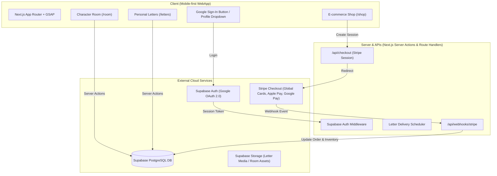

# Pawsons — Full Development Roadmap (4 Phases)

> **Core Philosophy**: Calm, simple & clean (ฟิลกู้ด สบายตา ไม่ต้องรีบไปต่อ)  
> **Tech Stack**: Next.js App Router (React 19, TypeScript), GSAP, **Supabase** (Auth + PostgreSQL), **Stripe Checkout** (International Payments)

---

## 🏗️ สรุปสถาปัตยกรรมระบบ (System Architecture)



---

## 🗄️ ออกแบบฐานข้อมูล (Supabase PostgreSQL Schema)

```sql
-- 1. ตารางโปรไฟล์ผู้ใช้ (ต่อขยายจาก auth.users)
create table public.profiles (
  id uuid references auth.users on delete cascade primary key,
  email text,
  display_name text,
  avatar_url text,
  assigned_character text, -- เช่น 'INFP', 'ENFJ' จากผล Quiz
  house text,              -- เช่น 'Verdant', 'Gilded'
  created_at timestamp with time zone default timezone('utc'::text, now()) not null,
  updated_at timestamp with time zone default timezone('utc'::text, now()) not null
);

-- 2. ตารางห้องของตัวละคร (Character Room)
create table public.user_rooms (
  user_id uuid references public.profiles(id) on delete cascade primary key,
  theme text default 'paper-classic',
  wallpaper text default 'default',
  placed_items jsonb default '[]'::jsonb, -- พิกัดและของตกแต่งที่วางในห้อง
  updated_at timestamp with time zone default timezone('utc'::text, now()) not null
);

-- 3. ตารางคลังไอเทมของผู้ใช้ (Inventory)
create table public.user_inventory (
  id uuid default gen_random_uuid() primary key,
  user_id uuid references public.profiles(id) on delete cascade not null,
  item_type text not null, -- 'furniture', 'stamp', 'badge', 'sticker'
  item_code text not null, -- รหัสสินค้า/ไอเทม
  acquired_via text not null, -- 'quiz', 'shop', 'letter_gift'
  created_at timestamp with time zone default timezone('utc'::text, now()) not null
);

-- 4. ตารางจดหมายส่วนตัว (Personal Letters)
create table public.letters (
  id uuid default gen_random_uuid() primary key,
  recipient_id uuid references public.profiles(id) on delete cascade not null,
  sender_type text not null, -- 'character' หรือ 'friend' หรือ 'system'
  sender_id text not null,   -- รหัสตัวละคร เช่น 'INFP' หรือ user_id ของเพื่อน
  stamp_code text default 'basic-paw',
  title text not null,
  content text not null,
  status text default 'in_transit', -- 'in_transit', 'delivered', 'opened'
  deliver_at timestamp with time zone not null, -- เวลาส่งถึง (Slow Mail Concept)
  opened_at timestamp with time zone,
  created_at timestamp with time zone default timezone('utc'::text, now()) not null
);

-- 5. ตารางคำสั่งซื้อร้านค้า (Orders & Stripe)
create table public.orders (
  id uuid default gen_random_uuid() primary key,
  user_id uuid references public.profiles(id) on delete set null,
  stripe_session_id text unique not null,
  stripe_payment_intent_id text,
  amount_total integer not null, -- จำนวนเงิน (เช่น หน่วย cents / satang)
  currency text not null,        -- 'usd', 'thb', ฯลฯ
  payment_status text not null,  -- 'pending', 'paid', 'failed'
  fulfillment_status text default 'unfulfilled', -- 'unfulfilled', 'fulfilled'
  shipping_details jsonb,
  items jsonb not null,
  created_at timestamp with time zone default timezone('utc'::text, now()) not null
);
```

---

## 📅 รายละเอียดการดำเนินงานทั้ง 4 Phase

### 🌿 Phase 1: Database & Google Authentication (รากฐานระบบ)
**เป้าหมาย:** ให้ผู้ใช้สามารถกดล็อกอินด้วย Google Account ได้อย่างปลอดภัย มีข้อมูลโปรไฟล์ และคงสถานะ Session ได้อย่างราบรื่น

1. **เตรียมการ Cloud & Credentials**:
   - สร้างโปรเจกต์ใน **Supabase Dashboard**
   - สร้าง OAuth 2.0 Client ID & Secret บน **Google Cloud Console**
   - ผูก Google Provider เข้ากับ Supabase Authentication
2. **ติดตั้ง Libraries ใน Next.js**:
   - `@supabase/supabase-js`, `@supabase/ssr`
3. **โครงสร้างโค้ด**:
   - `src/lib/supabase/client.ts` (Browser Client)
   - `src/lib/supabase/server.ts` (Server Client / Server Actions)
   - `src/middleware.ts` (จัดระเบียบ Cookie / Session Refresh อัตโนมัติ)
4. **ส่วนติดต่อผู้ใช้ (UI Components)**:
   - ปุ่ม **Sign in with Google** บริเวณมุมบนของ Header (รองรับธีม Paper/Ink สบายตา)
   - เมนูผู้ใช้ (User Dropdown/Drawer) แสดง Avatar, ชื่อผู้ใช้, สถานะตัวละคร และปุ่ม Sign Out
   - เชื่อมต่อให้ผลการทำ Quiz (`/quiz`) บันทึกลง Profile ผู้ใช้อัตโนมัติเมื่อล็อกอิน

---

### 🏡 Phase 2: User Profile & Character Room (ห้องตัวละคร)
**เป้าหมาย:** สร้างพื้นที่ส่วนตัวอันอบอุ่นของผู้ใช้ ที่มีตัวละครประจำตัวคอยต้อนรับ พร้อมจัดวางสิ่งของตกแต่งได้

1. **หน้าโปรไฟล์ (`/profile`)**:
   - แสดงตราประจำบ้าน (House Badge: Verdant, Gilded, etc.)
   - การ์ดตัวละครประจำตัว พร้อมปุ่มแชร์ IG Story Card ที่สร้างเฉพาะบุคคล
   - ประวัติกิจกรรม และรายการจดหมาย/ไอเทมสะสม
2. **หน้าห้องตัวละคร (`/room`)**:
   - **Visual Design**: ภาพห้องโทนกระดาษอุ่นๆ (Paper aesthetic) มีหน้าต่างมองเห็นบรรยากาศกลางวัน/กลางคืน
   - **Interactive Mascot**: ตัวละครประจำตัวนั่ง/ยืนในห้อง ขยับแบบ Idle Animation ด้วย **GSAP** (กระพริบตา, โบกมือเบาๆ เมื่อแตะ)
   - **Furniture & Decor Placement**: ระบบวางของสะสมหรือไอเทมที่ได้รับจากกล่องจดหมาย/ร้านค้า
   - มีปุ่ม "เยี่ยมชมห้องเพื่อน" (Shareable Room Link) เปิดให้คนอื่นเข้ามาดูห้องได้แบบ Read-only

---

### ✉️ Phase 3: Personal Letters System (`/letters`)
**เป้าหมาย:** ฟีเจอร์จดหมายสไตล์ Slow-Life *"เหมือนแชทกับตัวละคร แต่ต้องรอเหมือนรอจดหมายจริง"* เพื่อให้รู้สึกอบอุ่นและได้พักผ่อน

1. **คอนเซ็ปต์การทำงาน (Slow-Mail Concept)**:
   - ผู้ใช้เขียนจดหมายส่งหาตัวละคร หรือกดขอรับคำปรึกษา/เรื่องเล่าประจำวัน
   - ระบบตั้งเวลา `deliver_at` (เช่น 6 ชั่วโมง, 12 ชั่วโมง หรือวันรุ่งขึ้นเวลา 09:00 น.)
   - ตัวละครจะตอบกลับมาพร้อมของขวัญเล็กๆ (เช่น สติกเกอร์ หรือคำคมฮีลใจ)
2. **ระบบกล่องจดหมาย (Mailbox UI)**:
   - ตู้จดหมายไม้หน้าบ้าน (แสดงไอคอนธงขึ้นเมื่อมีจดหมายใหม่)
   - แท็บ: **กล่องจดหมายเข้า (Inbox)**, **จดหมายที่กำลังเดินทาง (In Transit)**, **คลังจดหมายเก่า (Memories)**
3. **อนิเมชันเปิดจดหมาย (GSAP Experience)**:
   - กดเปิดซองจดหมาย มีเอฟเฟกต์แกะครั่ง/สแตมป์ และคลี่กระดาษจดหมายออกมาอย่างนุ่มนวล
   - ระบบเก็บสแตมป์สะสม (Stamp Book) เป็นมินิเกมให้สะสมสแตมป์จากทุกตัวละคร

---

### 🛍️ Phase 4: E-commerce Shop & International Stripe Checkout
**เป้าหมาย:** เปิดร้านค้า Pawsons Store อย่างเต็มรูปแบบ รองรับการสั่งซื้อสินค้าน่ารักๆ ทั้งสินค้าจริง (Physical Merch) และสินค้าดิจิทัล (Digital Items) รับเงินได้ทั่วโลก

1. **เตรียมการ Stripe**:
   - สมัครบัญชี **Stripe** (เปิดรับบัตรเครดิตสากล, Apple Pay, Google Pay)
   - ติดตั้ง `stripe` และ `@stripe/stripe-js`
2. **อัปเกรดหน้า `/shop`**:
   - เปลี่ยนจาก Mock Data ใน `data.ts` ให้ดึงรายการสินค้าจาก Database
   - ตะกร้าสินค้าแบบ Drawer (Slide-over Cart) ที่ใช้งานง่ายบนมือถือ
   - รองรับการกรองสินค้าตาม Character และ House
3. **ระบบชำระเงิน (Stripe Hosted Checkout)**:
   - ผู้ใช้กด "Checkout" -> ระบบเรียก Next.js Route Handler สร้าง Stripe Checkout Session
   - ส่งผู้ต่อไปยังหน้าจ่ายเงินที่ปลอดภัยของ Stripe (รองรับภาษาอังกฤษ/ไทย, สกุลเงิน USD/THB อัตโนมัติ)
4. **Stripe Webhook (`/api/webhooks/stripe`)**:
   - ดักฟัง Event `checkout.session.completed`
   - บันทึกสถานะคำสั่งซื้อลงตาราง `orders` ใน Supabase
   - หากเป็นไอเทมดิจิทัล (เช่น สติกเกอร์, ตั๋วสแตมป์, ของแต่งห้อง) ระบบจะเพิ่มเข้า `user_inventory` ทันทีอัตโนมัติ
   - หน้า `/shop/success` แสดงใบเสร็จน่ารักๆ ธีม Pawsons พร้อมอนิเมชันของขวัญ

---

## 🔒 Security & Best Practices
- **Row Level Security (RLS)**: บังคับใช้ใน Supabase ทุกตาราง ผู้ใช้เข้าถึงได้เฉพาะข้อมูลห้อง/จดหมาย/ออเดอร์ของตนเอง
- **Stripe Webhook Verification**: ตรวจสอบ Header Signature ป้องกันการส่ง Request ปลอม
- **Environment Variables**: เก็บ Private Key (`SUPABASE_SERVICE_ROLE_KEY`, `STRIPE_SECRET_KEY`) ไว้เฉพาะ Server-side เท่านั้น
